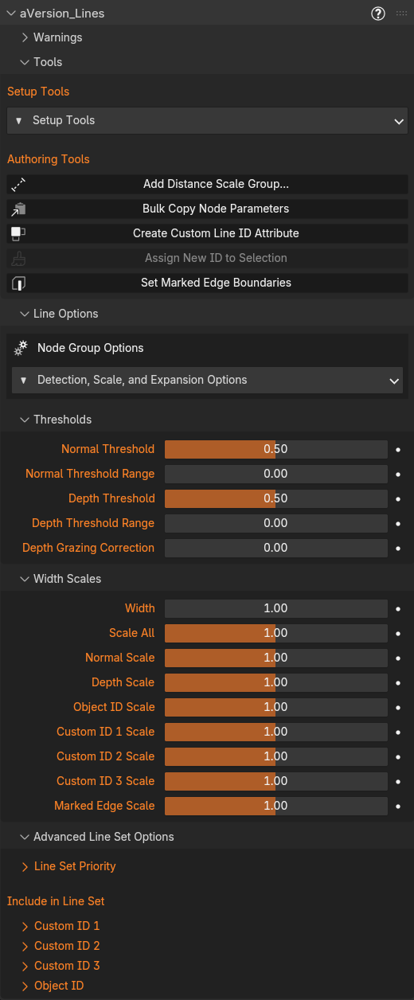
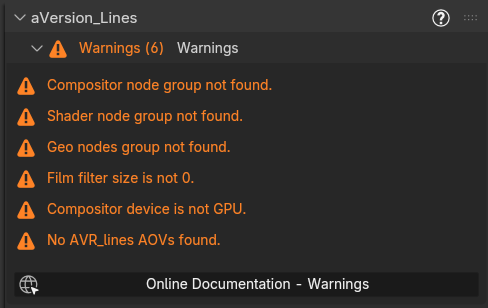
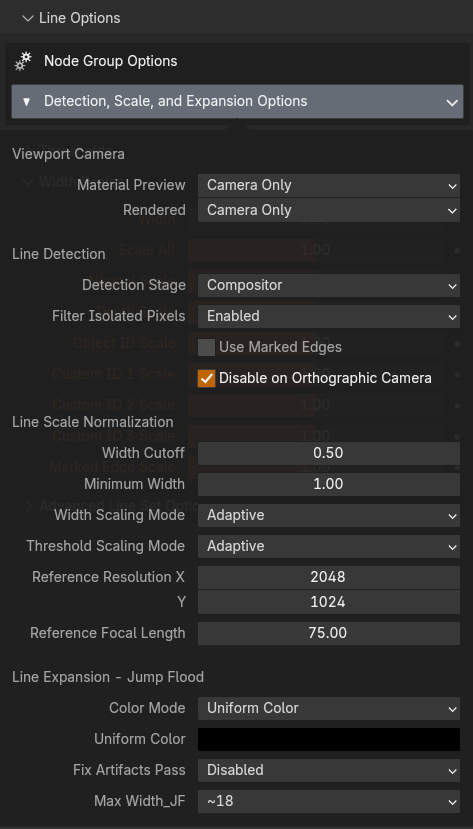
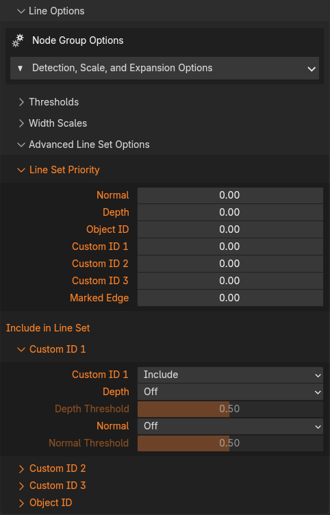

# The Addon Panel

The panel title has a small **?** button on the right that opens this documentation.

{ width="520" }

## Warnings

A collapsible section that lists anything wrong with the current setup, with a count in its header so you can see at a glance whether anything needs attention. Most clear automatically as you run the Setup Tools. Each entry below shows the message and what to do about it. The node-group checks are rename/duplicate tolerant, so a renamed or copied group still counts as present. 

{ width="488" }

- **Compositor node group not found:** The `AVR_Lines: Line_Art` group isn't in the file. Run **Append Node Groups**, then **Add Compositor Nodes**.
- **Shader node group not found:** The `AVR_Lines: Shader_Data` group isn't in the file. Run **Append Node Groups**, then **Add AOV Group to Materials**.
- **Geo nodes group not found:** The `AVR_Lines: Geo_Data` group isn't in the file. Run **Append Node Groups**, then **Add Geometry Node Group**.
- **Depth pass not enabled:** The view layer's Z (Depth) pass is off, so the compositor has no depth to detect from. Run **Set Render Settings**, or enable it manually under View Layer → Passes → Data → Z.
- **Film filter size is not 0:** Anti-aliasing is still on, which blurs edges across pixels and causes over detection. Set Render → Film → Filter Size to 0 (or run **Set Render Settings**). Sometimes this is fine, and over detection can be compensated for by reducing line thickness. See [Technical Notes](technical-notes.md).
- **Compositor device is not GPU:** The compositor is set to CPU, which is far slower for this workload. It should technically work, but I've given up waiting to see if it will complete. Switch Render → Compositing Device to GPU (or run **Set Render Settings**).
- **Rendered viewport compositor disabled:** A 3D Viewport has its compositor set to Disabled, so lines won't show there. Set the viewport's compositor to Always (or Camera) in the shading dropdown.
- **No AVR_lines AOVs found:** The AOV outputs the shader writes into don't exist on the view layer, so no line data reaches the compositor. Run **Set Render Settings** to create them.
- **Current Camera is Orthographic, lines disabled:** You have **Disable on Orthographic Camera** enabled and are currently viewing through an orthographic camera, so line output is intentionally off. Switch to a perspective camera, or turn that option off (orthographic support is limited, see the option's note).
- `'<material>': N of 15 attributes used`**:** That material is within two slots of EEVEE's per-material attribute limit. Nothing is broken yet, but adding another texture, UV map, or color attribute may push it over. See [Material attribute limit](troubleshooting.md#material-attribute-limit).
- `'<material>': N attributes, over the 15 limit`**:** That material asks for more attributes than EEVEE can bind. The extras are **silently dropped**, so some attributes read as blank or wrong with no error anywhere. Only materials containing the `AVR_Lines: Shader_Data` group are checked. See [Material attribute limit](troubleshooting.md#material-attribute-limit).

## Tools

**Setup Tools** *(popover)*, the setup operators: See [Setup Tools](setup-tools.md)

- **Append groups**
- **Set render settings**
- **Add nodes/modifiers/materials**
- **Update**
- **Clean up**

**Authoring Tools**, the operators you use while working: See [Authoring Tools](authoring-tools.md)

- **Add Distance Scale Group:** distance-based width scaling ([Distance Scaling](distance-scaling.md)).
- **Bulk Copy Node Parameters:** copy AVR_Lines Node Group values between objects/materials.
- **Create Custom Line ID Attribute:** generate region IDs.
- **Assign New ID to Selection:** add a new ID onto selected faces.

---

## Line Options

Controls for the Compositor Node Group. The Thresholds and Width Scales are the inputs on the node group, placed here for convenience while working in other editors. The less used configuration options change connections inside the node group; the least used of these live in the **Detection, Scale, and Expansion Options** popover, while everything else is a collapsible section you can leave open while you work.

Thresholds, Width Scales, and Advanced Line Set Options are all collapsible sub-panels. Click a header to fold it away. Thresholds and Advanced Line Set Options start collapsed.

### Detection, Scale, and Expansion Options *(popover)*

{ width="473" }

**Viewport Camera:**

Everything the line system measures (FOV, focal length, adaptive-width scaling, distance scaling, and the depth range) comes from the **Active Camera**. The viewport navigation camera is never used because Blender does not currently let us properly distinguish between Viewport and Full Renders in the compositor (this is coming soon, and then hopefully the viewport navigation camera can be supported too). The Active Camera in the viewport matches what an F12 render will produce (except for resolution differences), but lines are only fully accurate inside the camera frame. These two settings control where the compositor runs, and so where you see lines at all.

- **Material Preview:** Compositor setting applied to Material Preview viewports.
  - *Camera Only* (default): Enables the compositor only while the viewport is in camera view (numpad 0), the only region that previews the render accurately.
  - *Always:* Composites the whole viewport. Lines outside the camera frame are still measured from the Active Camera, so their widths will not match a render.
  - *Don't Change:* Leaves the setting alone if you prefer to manage it yourself.
- **Rendered:** The same options, applied to Rendered viewports.

!!! warning "Keep the whole active camera frame in view"
     If you unlock the active camera and zoom in, or move the view so part of the active camera is off screen, it can cause dead zones near the border inside the camera frame where lines won't draw. This is due to some issue with Dimensions inputted into the compositor. If your lines are disappearing near the edges of the camera in the viewport while zoomed in on it, this is why. See [Known Issues](known-issues.md).

**Line Detection:**

- **Detection Stage:** Compositor or Raycast (Not yet implemented). A placeholder for when the Raycast node gets more features and can be used instead.
- **Filter Isolated Pixels:** Runs an extra neighbor check on the detected lines before expansion that removes any lone pixels with no neighbors. Almost totally neglibile performance cost, but may not match some styles.
- **Use Marked Edges:** Enable/Disable marked edges. This globally disables the extra Marked Edge attribute in the Shader_Data group, which can help avoid hitting the material attribute limit. Also saves some performance cost.
- **Disable on Orthographic Camera:** Enable/Disable line output when the current view is an orthographic camera. Orthographic cameras need different handling of FOV, Pixel Size, and Depth Thresholds that are not currently implemented, but could be in the future if there's enough interest. For now, use at your own risk

**Line Scale Normalization:**

- **Width Cutoff:** Masks out lines below this thickness before Minimum Width potentially increases their thickness. This is to prevent very thin line values that would still be full grey pixels, and helps lines that scale to 0 at certain distances/thresholds not need to pass through this grey range. But it can make lines that taper to 0 less sharp.
- **Minimum Width:** Minimum Line Width. Any lines that were not set to 0 by **Width Cutoff** will be set to at least this. Values below 2 can cause aliasing issues. Below 1 are not full value, as you cannot partially fill a pixel, only fill it with a lighter value. Note that this setting is *not* resolution adaptive. If you are working in the viewport at 1,024x1,024 resoltuion, minimum width of 5 means something very different than a full render at 4096x4096. This setting is best used as a guard against small values, not to determine the artistic look. Do that with the actual width scale.

!!! note "Width Cutoff and Minimum Width are not relative"
     Width Cutoff and Minimum are *not* resolution adaptive. If you are working in the viewport at 1,024x1,024 resoltuion, minimum width of 5 means something very different than a full render at 4096x4096. These settings are best used as a guard against small values, not to determine the artistic look. Do that with the actual width scale.

- **Width Scaling Mode:** 
  - *Pixel:* Width values are literal pixels. If Line Width = 5, lines will be 5px thick, regardless of render resolution or camera lens.
  - *Adaptive:* Width compensates for render resolution and camera focal length relative to the Reference settings, so a shot keeps the same look when resolution or lens changes. At the reference resolution and focal length, authored values are literal pixels. Distance-based scaling is set separately (in the shader nodes or geometry nodes). See [Width & Scaling](width-and-scaling.md).
- **Threshold Scaling Mode:** Applies to Depth and Normal thresholds, including the per-line-set thresholds in Include in Line Set.
  - *Fixed:* Threshold values are used exactly as set.
  - *Adaptive:* Detection thresholds are compensated against the Reference Resolution, so a single threshold value detects the same lines at any render resolution and matches between the viewport and an F12 render.

!!! note "Why Adaptive Thresholding is necessary"
    Detection compares neighbouring pixels, and a pixel covers a different amount of world space at every resolution. Without compensation the same threshold detects more lines at low resolution and fewer at high. The viewport is affected too, because the viewport compositor works at the size of the camera frame on your screen, not at the render resolution, so a preview would not match the render. Adaptive is the default and should generally be left on. *Fixed* is for raw values and debugging.

- **Reference Resolution:** Render width/height your settings are authored for. Used by *both* Adaptive width scaling (widths are literal pixels at this resolution) and Adaptive threshold scaling (thresholds are compensated against it). Both systems pick which value to measure against from the camera's Sensor Fit: *Horizontal* uses X, *Vertical* uses Y, and *Auto* uses whichever is larger.
- **Reference Focal Length:** Camera focal length (mm) where line widths are literal. Adaptive scaling compares the current camera lens to this. Width only, does not affect thresholds

**Line Expansion (Jump Flood):**

- **Color Mode:**
  - *Varying Color:* Allows different color and thickness per object/material/pixel, sorted by depth priority. Uses the Color set in the Geometry Nodes or the Shader Nodes and expands it from the source pixel.
  - *Uniform Color:* Outputs a mask only and colors it with the Uniform Color value in the compositor. Allows different thickness but does not expand color from the source pixel. The mask will use the Uniform Color, or can be used to mix colors in the Compositor.
- **Uniform Color:**  Color used for Uniform Color mode.
- **Fix Artifacts Pass:** Run an extra jump flood pass to fix jump flood artifacts, such as missing pixels inside a line. Moderate performance cost. Should only be necessary on very thick lines.
- **Max Width:** Approximate maximum expanded line width in pixels. Each increase is another jump flood pass. All pixels up to this width are evaluated even if line thickness wouldn't use them, so do not set higher than you need! Each additional jump costs the same amount despite covering more pixels. This is the bigget factor in the performance cost of the setup! The largest size can double the evaluation time compared to the smallest.

### Thresholds

- **Normal Threshold:** Detects Normal lines where the angle between neighbors is above the threshold. The scale is logarithmic: each 0.25 covers a 10x range, so lower values detect progressively subtler angles. Compensated for resolution when Threshold Scaling Mode is Adaptive. Remember, this compares Normals in Screen space, it does *not* detect creases between neighboring faces in the geometry unless they fall on adjacent pixels. And it can fail to detect differences in overlapping objects if the surface faces in the same direction. See [Line Types](line-types.md).
- **Normal Threshold Range:** Scales thickness of Normal lines based on how much they are over the threshold. Lines that barely meet it are thinner, creating soft falloff. Multiplicative: 0.5 softens over a 10x band, 1.0 over 100x. Often messy, use with caution. Minimum Line Width can stop clean tapering.
- **Depth Threshold:** Detects Depth lines where surface curvature is above the threshold. The scale is logarithmic: each 0.25 covers a 10x range, so lower values detect progressively gentler curvature. Not in real-world units (a 0.1 threshold does not mean 0.1m). Compensated for resolution when Threshold Scaling Mode is Adaptive.
- **Depth Threshold Range:** Scales thickness of Depth lines based on how much they are over the threshold. Lines that barely meet it are thinner, creating soft falloff. Multiplicative: 0.5 softens over a 10x band, 1.0 over 100x. Often messy, use with caution. Minimum Line Width can stop clean tapering.
- **Depth Grazing Correction:** Masks depth lines based on facing angle to prevent every step being detected on surfaces curving away from the camera. This can avoid issues at lower thresholds, but is a primitive fix. For more control, use a Custom ID and the Depth Inclusion and masking system in Advanced Line Set Options. Then the depth lines can be masked to areas detected by ID or Normal lines as well, which will stop overdetection on curved surfaces.

!!! note "Grazing Correction can be inconsistent in viewport vs final render"
    Grazing Correction attenuates the detection *signal* rather than the threshold, so it sits outside the Adaptive threshold compensation. Surfaces facing the camera match across resolutions as expected, but surfaces near the grazing angle can still detect somewhat differently. If you are comparing resolutions and see differences only on steeply angled surfaces, this is why.

### Width Scales

- **Width:** Base line width in pixels. Each Line Set's scale is multiplied by this.
- **Scale All:** Multiplies all line types. Technically does the same thing as 'Mask All', but it is useful to have two inputs to separating scaling and masking.
- **Normal Scale:** Width multiplier for Normal lines.
- **Depth Scale:** Width multiplier for Depth lines.
- **Object ID Scale:** Width multiplier for Object ID lines.
- **Custom ID 1–3 Scale:** Width multiplier for each Custom ID line set.
- **Marked Edge Scale:** Width multiplier for Marked Edge lines.

!!! note "Greyed-out rows"
    A parameter row appears disabled when the compositor has a live link feeding that input, so the node connection is overriding the panel value.

### Advanced Line Set Options

{ width="482" }

For when and why to use these, see [Advanced Line Set Options](custom-ids.md#advanced-line-set-options) in the Object & Custom IDs page.

A collapsible sub-panel, closed by default. Because it is docked rather than a popover, the fields behave like any other panel value: **Backspace** resets one to its default, and you can click straight from it to anything else without dismissing it first.

- **Line Set Priority:** Per-line-type draw priority. If a pixel is detected by multiple line sets, the default is for the thickest to take priority. Set a higher priority for a line set to have it win even if it is thinner. This can be used to allow thinner detail lines to not be covered up by thicker contour lines.
- **Include in Line Set:** Fold Depth and/or Normal detection into each line set (Custom ID 1-3 and Object ID). Completely separate from the actual Depth/Normal line sets, so areas that can't be marked on the mesh with a boundary still get lines with thickness matching the rest of that line set. Use to fill gaps or detect overlaps. Each line set has its own Depth and Normal thresholds, which follow Threshold Scaling Mode exactly like the main thresholds do.

!!! note "Inclusion Options"
    Each channel (the line set's own edge, Depth, Normal) has a role: **Off** ignores it, **Include** adds it to the line set, **Mask** keeps the line set only where that channel also detects. When several channels are set to Mask, the line survives only where all of them detect. Use Mask for targeted gap fillers.

---

**Related:** [Setup Tools](setup-tools.md) · [Authoring Tools](authoring-tools.md) · the [node group reference](node-line-art.md) for what's inside the groups.