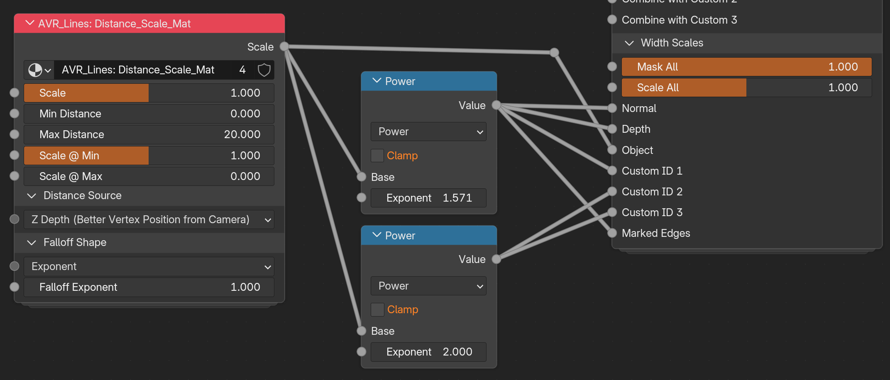
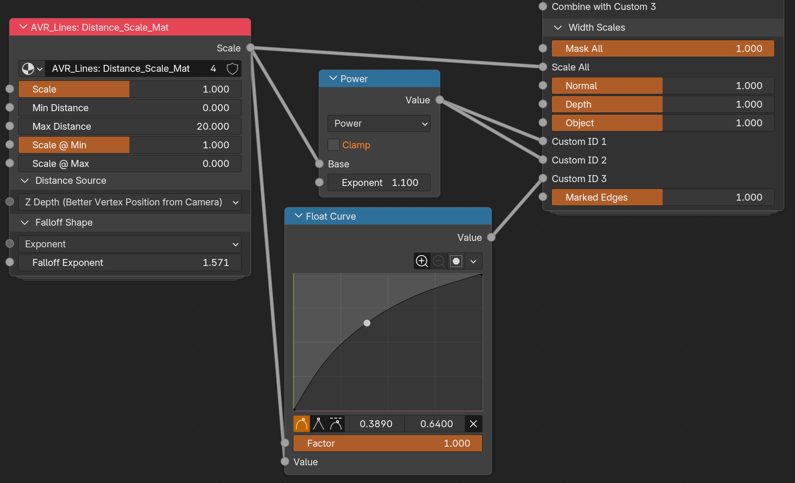

# Distance Scaling

!!! info "Work in progress"
    This page is **minimum viable content** for the initial release. The text covers
    the essentials, but images, diagrams, and clips are still being made, and some
    sections will be expanded. More is being added over the coming weeks.

Distance scaling varies line width by distance. Thinner lines as things recede, or thicker lines up close. It has nothing to do with the [Pixel and Adaptive width modes](width-and-scaling.md), which are about resolution and lens.

## How to use it

Here's the basic idea: the Distance Scaling group is a fancy version of the Map Range node. You define the range the change happens over, and the shape of the change. Linear falloff means something twice as far away is half the scale. But often that isn't what we want artistically, hence the various curve and exponent options (which create a curve mathematically.)

You can also use further curves on the output of the group to alter the falloff curve for different inputs. For example, you might set the group to have an exponent of 1 (linear falloff) and plug that into Object Scale. But then run the output of the group through Power nodes or Float curves before plugging into Custom IDs. This would cause the Custom ID lines to falloff differently, which is how you let interior details disappear sooner at range than silhouette lines.

You can also chain the Distance Scaling group to alter the scale both from the camera and from another source. This is useful for effects, such as an explosion that doesn't literally cast light, but should thin lines closer to it.

!!! note "You can use Map Range in the Compositor too"
    You can also control the distance scaling in the Compositor with Depth and Map range. I didn't include a Ditance Scaling group in the compositor as it would lack options other than Z depth, so there would be no functional difference from just using Map Range.


## Examples


### Different falloff per line type

Both of these use one Distance_Scale group and reshape its output on the way to the Width Scales, so each line type falls off on its own curve. The group itself stays simple, and the variation happens outside it.

{ width="860" }

Its raw output goes straight to **Scale All**, so everything gets the plain linear falloff as a baseline. From there it's split: one **Power** node at exponent 1.571 (half pi is a good curve) feeds Normal, Depth and Object, and a second at exponent 2.0 feeds the three Custom IDs and Marked Edges. Higher exponents fall off faster, so the interior detail lines thin out and disappear well before the silhouette does.

{ width="860" }

Same idea with a hand drawn curve. The group is doing an exponent of 1.571 this time, a **Power** node at 1.1 handles Custom ID 1 and 2, and a **Float Curve** shapes the falloff for Custom ID 3. The curve gives you direct control over the shape rather than describing it with a number, which is easier when you are matching a look by eye. The Power and Float Curve are operating on top of the original Falloff of 1.571. So both are defining a bit more falloff on top of what's already there.

Note that Marked Edges is on 1.0 in the second shot, so those lines hold their width at any distance while everything else thins out.

## Adding a Distance Scale group

Distance scaling comes from the **Distance_Scale** node group, added with the **Add Distance Scale Group** tool. It comes in two versions depending on where you want to author it:

- **Material:** puts `Distance_Scale_Mat` into a material and wires it into a Shader_Data width scale socket.
- **Geometry Nodes:** puts `Distance_Scale_GN` into the object's Geo_Data container and wires it into a Geo_Data width scale socket.

The controls are the same in both apart from the Distance Sources, which differ between them (see below). See [Authoring Tools](authoring-tools.md) for the dialog.

## The controls

The `Scale` output plugs into a Width Scale, and from there distance drives that line type's width.

- **Min / Max Distance:** the distance range the scaling happens over.
- **Scale @ Min / Scale @ Max:** the width scale at each end of that range.
- **Distance Source:** how distance is measured. See the table below.
- **Falloff Shape:** the curve between the two ends. Exponent, Closure, Smoothstep, Smootherstep, or Stepped. Closure lets you feed in your own curve, so a Float Curve or Color Ramp works well there.

!!! note "You can alter the falloff after the node group too"
    Putting an exponent of 1 and then a Power node or Curve on the output of the Distance Scale group works too. The reason there is an input is to allow it to be controlled from a node group input (or with an inputted Closure), allowing more flexibility if grouping your nodes.

### Distance Source


| Source                                                                                  | Material | Geometry Nodes |
| --------------------------------------------------------------------------------------- | -------- | -------------- |
| **Z Depth**: depth along the camera's view axis. The default and generally best option. | ✅        |                |
| **Vertex Position from Point**: distance to a position you specify.                     | ✅        | ✅              |
| **Two Points**: distance between two positions you specify.                             | ✅        | ✅              |
| **Vertex Position from Active Camera**: radial distance to the camera.                  |          | ✅              |
| **Point from Active Camera**: radial distance from one specified point to the camera.   |          | ✅              |


### Z Depth vs. distance to the camera

These are not quite the same measurement.

**Z Depth** is the perpendicular distance to the camera plane, the same value the Depth pass holds. So every point on a flat wall facing the camera reads as the same distance. Position from Active Camera (aka radial distance from camera) measures the straight line from the camera out to the point instead, which means the corners of that wall are genuinely further away than the middle and get treated as such.

This means lines get thinner toward the edges of frame because of where they sit in the image rather than where they are in the scene, and a wider lens makes it worse. That's why Z Depth is the default. But radial is a stylistic choice in itself, so use it if you want it.

!!! note "Z Depth is material only, for now"
    Z Depth reads Camera Data directly in the shader and never needs the camera's position, so it costs nothing there.

```
The camera modes are geometry nodes only for the opposite reason. Geometry nodes read the Active Camera natively, but a shader can't. The only ways in are writing node values from Python or using a driver, and **both throw away the compiled material every time the camera moves**. You see that as surfaces flashing grey while you move around, which on a heavy scene can take seconds to recover from on every frame.

Geometry nodes could work out Z Depth too, by inverting the camera transform, transforming the position into camera space and negating Z. It just isn't set up in `Distance_Scale_GN` yet, and it would be extra computation there when the shader already has the value for free. Probably a later version.
```

---

**Next:** [Authoring Tools](authoring-tools.md) · [Distance_Scale node reference](node-distance-scale.md)