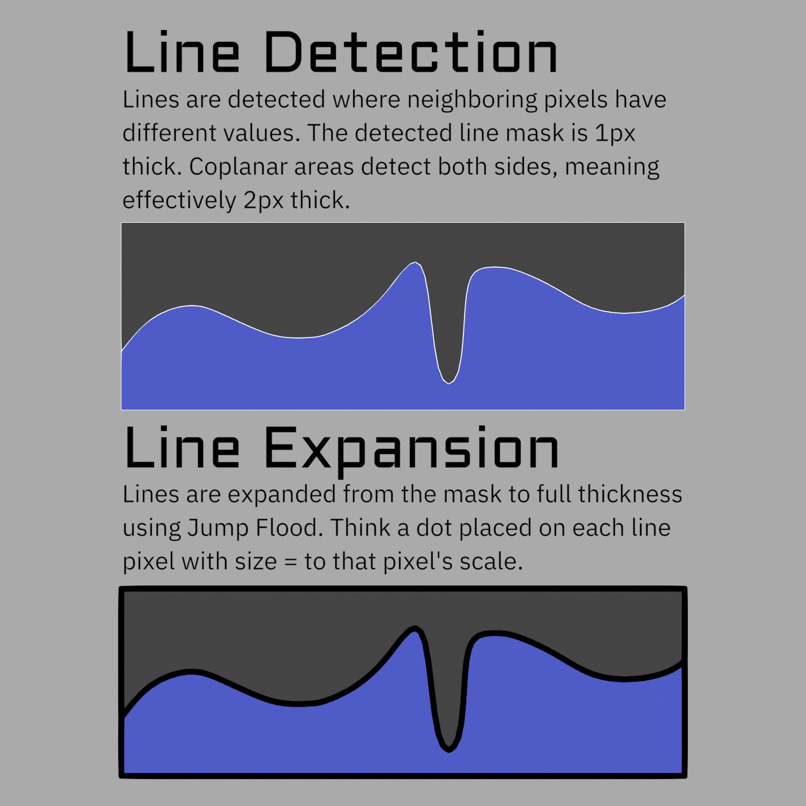

# How It Works

!!! info "Work in progress"
    This page is **minimum viable content** for the initial release. The text covers
    the essentials, but images, diagrams, and clips are still being made, and some
    sections will be expanded. More is being added over the coming weeks.

The core idea is simple, and understanding it makes the rest of the tool much clearer.

{ width="860" }

## Lines are found from differences between neighboring pixels

The tool finds edges by comparing each pixel to its neighbors (up, down, left, and right. But not diagonals). **Where a neighboring pixel differs enough in some value, the pixel is a line.** That value can be depth, surface normals, an object ID (flat value per area), or any data you choose to output.

Because it works on *data*, not geometry, you're not limited to silhouettes and creases (see [Line Types](line-types.md)).

## Strengths and Weaknesses

Most line art tools work the other way around. They analyse the mesh, build actual stroke geometry along the edges they find, and render that. Freestyle, Grease Pencil's Line Art modifier, and Pencil+ all do some version of this. Knowing where the two approaches split is the quickest way to tell whether this suits what you're doing.

**What screen space does better:**

- **It can draw lines on anything.** Geometry based tools only see geometry, so they can't put a line on the edge of a toon shading band, or a painted mask, or a texture. If you can compute it in a shader, this can draw a line on it.
- **Scene complexity doesn't matter.** Cost is flat per pixel, so a million polygon character costs the same as a cube. Geometry based lines get slower as meshes get denser, and denser meshes are usually exactly when you want them. What costs you here is resolution and line thickness instead, which are things you control directly.
- **It's fast enough to work with.** Geometry Lines are calculated on CPU and so are slow (except inverted hull) and their cost scales with mesh complexity. Freestyle and Grease Pencil's Line Art both have to rebuild their strokes when things change, which puts them somewhere between slow and not viable for previewing as you work. This updates in the viewport, so you can tune thresholds and widths and see the result immediately.
- **Thick lines hold up better.** Geometry strokes can be extruded to any width, but past a certain thickness they start showing their construction: end caps poke out, strokes clip through each other at corners, and overlaps stop reading as one line. Expanding from pixels sidesteps all of that, so thick lines stay clean.
- **Thickness can vary per pixel**, driven by any data you like, from any stage of the pipeline.

**What it gives up:**

- **No hidden lines.** It only knows what the camera rendered. Nothing occluded or off screen gets a line, and a line stops where the object in front of it starts. Geometry based tools can see the whole mesh and draw the hidden parts if you ask them to.
- **You get pixels, not strokes.** There are no line objects, so nothing you would normally do to a stroke is available. No tapering along the length of a line, no textured or brush-like strokes, no vector export. Width varies per pixel, not along a stroke.
- **Resolution is the limit of detail.** Anything finer than a pixel isn't there to detect, so fine features come and go as you change resolution. Geometry lines handle this better due to anti-aliasing, but it only really matters at very low resolutions.
- **Depth and Normal lines are noisy.** Their data varies pixel to pixel, so they flicker and crawl in ways geometry contour lines don't. That's why the ID line sets exist, and why most of your lines should come from them. See [Line Types](line-types.md).
- **Anti-aliasing has to be off**, and put back afterwards in the compositor. This will hopefully change soon, as multiple things on Blender's roadmap can resolve it.

Neither approach is better than the other, they're just good at opposite things. And there's nothing stopping you using both in the same shot. I plan to add the option to feed geometry lines into this system in a future update, which will give you the best of both worlds. See [Known Issues](known-issues.md) for the full list of what to expect.

## The pipeline

Data flows through three node groups, in this order:

1. **Geo_Data** *(Geometry Nodes modifier on your objects)* writes per-object data onto the mesh: object IDs, custom ID attributes, marked edges, and per-object width scales.
2. **Shader_Data** *(shader group in your materials)* writes all the per-pixel data into **AOVs** (render passes): normals, thresholds, scales, IDs, colors. It can also mix in material or procedural data.
3. **Line_Art** *(compositor group)* reads those AOVs plus the Depth pass, detects the lines, expands them to the right width, and outputs the final line image.

!!! note "Why AOVs?"
    AOVs are how we can get additional data into the compositor. Eevee supports them in the viewport in 5.2, but Cycles does not yet.

## Why anti-aliasing has to be off

Comparing neighboring pixels breaks down on anti-aliased data. AA blurs edges across several pixels, so a single edge gets detected multiple times. That means extra thickness, and worse, broken threshold detection (especially on normals). So the setup **disables Blender's film anti-aliasing** and re-adds it afterward with the compositor's AA node.

The compositor's AA is not as good as native AA, and it can also blur the outermost pixels of the image, since its samples run off the edge of frame and get clamped back onto the border pixel. This is the tool's biggest quality trade-off, and [Technical Notes](technical-notes.md) covers the workarounds.

## Why the Depth pass has to be on

Depth lines need depth, but it is used for more than that. Depth also drives **priority sorting**, so closer lines draw over further ones in colored mode, and it feeds **distance based width scaling**. Set Render Settings enables the Z pass for you.

!!! note "Why no Normal pass?"
    The setup uses an AOV to carry its own Normal pass so that you can feed it different Custom Normals if you want. Normal Lines often don't work well with very smooth toon Normals, or you could even author an extra path with smoothing settings that do work well for them.

## How lines get thick (Jump Flood)

Detection finds one pixel wide edges. To make lines thick, the tool expands those seed pixels outward with a **Jump Flood** algorithm, where each pass roughly doubles the reach. That is what lets you have very thick lines without paying for every pixel of thickness.

**Max Width** decides how many passes run, and **every pixel pays that cost whether or not its lines are actually that thick.** So it is the main performance cost. Don't set the max thickness higher than you actually need. See [Width & Scaling](width-and-scaling.md).

## What comes out

The Line_Art group outputs a line image, plus a few debug passes. You combine it with your render however you like, usually with an **Alpha Over** node. As far as Blender is concerned these are just pixels in the compositor, so you can treat them like any other image and style them from there.

---

**Next:** [Line Types](line-types.md), the different kinds of lines and what each threshold means.