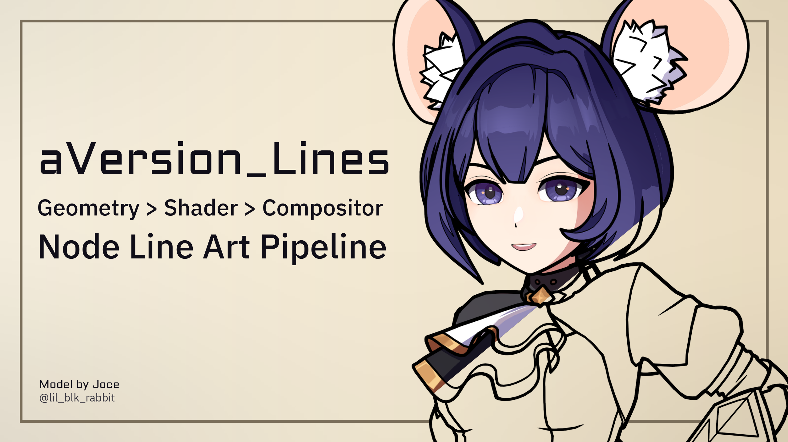
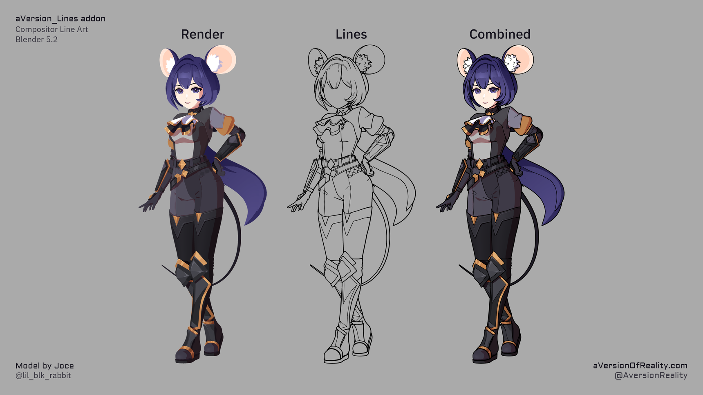

# aVersion_Lines

{ width="860" }

**Screen-Space Extraction (SSE) Jump Flood line art for Blender's Compositor, with a node pipeline from Geometry Nodes > Material Nodes > Compositor, allowing data to be authored or altered at any step.**

<video controls loop muted playsinline preload="metadata"
       poster="images/turntable-1-poster.png"
       width="860" style="max-width:100%;height:auto;">
  <source src="images/turntable-1.mp4" type="video/mp4">
  Your browser can't play this clip.
  <a href="images/turntable-1.mp4">Download it instead</a>.
</video>

## Where to get it

- **Gumroad**: coming soon
- **Superhive**: coming soon

## Get Started

- **[Installation](installation.md)**
- **[Quick Start](quick-start.md)**
- **[How It Works](how-it-works.md)**
- **[Infographics](infographics.md)**

---

## What It Is

This tool creates line art directly from rendered images in Blender's Compositor. It uses neighboring pixel comparisons to detect edges from differences in depth, Normals, IDs, or any other data you feed it. Then it uses a Jump Flood algorithm to expand the detected lines, allowing for very thick lines at relatively little extra cost.

Most line art options work by analyzing the mesh to construct geometry strokes and then render them. They are strong when it comes to geometry features, but blind to everything else. They can't be used to draw lines on data from the shader such as the edges of toon shading or an arbitrary texture mapped onto the model (unless they are very fancy and combine elements of both approaches, like PSOFT Pencil+). But Screen Space Line Art can draw lines on any data sent to the Compositor as long as it is formatted correctly. And this addon allows line thickness to be scaled per pixel, and with data from any step in the pipeline, giving enormous artistic flexibility.

This is an advanced version of filter-based line art that is common in programs like Photoshop and can already be done in basic form with Blender's Filter nodes. It has access to much more data via passes and AOVs, and uses its own sampling instead of existing filter nodes. This allows for proper Depth and Priority comparisons and seed tracking when expanding lines. This means you can have varied line thickness and color, and closer lines properly take priority over further ones rather than the thickest line always winning. Typical filter nodes are fine for slapping basic thin lines over the whole image, but this system allows proper authoring control without losing 3D interactions like occlusion. This is the difference between a rigid uniform effect and actually having artistic and stylistic control. This all comes at a considerable performance cost compared to simple filters, but still runs at interactive speeds on most hardware, even in the viewport.

This is the same general form of lines as the new Raycast Shader node in Eevee, but currently more granular, accessible, and flexible. As the Raycast node gets more options it will be integrated into the addon's line detection system. And the pipeline and authoring tools could be adapted to a Raycast node workflow right now if you wanted.

The tool consists of several node groups that feed data into each other: Geometry Nodes, Material Nodes, and then the main Compositor group. And a Python addon that helps setup everything, manage settings, and author custom data.

This tool is inspired by the line art system from the [Malt render engine](https://malt3d.com/), which offers essentially the same sort of lines but with vastly better performance if you are willing to use a custom render engine. Check it out!

*Development Note: This is not an AI tool, and does not involve any Generative AI. Code assistants were used to help with research, and help create the python addon (ie, setup UI panels, build operators, etc.)*

---

## Requirements

- **Blender 5.2 or newer.** The addon uses compositor and geometry nodes that don't exist in earlier versions.
- **EEVEE.** The line data uses AOVs, which are only supported in the viewport in EEVEE. So it doesn't work in the viewport in Cycles. Full renders should work properly in Cycles, but that has not been put through practical testing yet. This has been an EEVEE focused tool for the first version, and Cycles will get more attention going forward.
- **A GPU that runs EEVEE and the GPU compositor.** The compositor runs on the GPU by default and is far slower on CPU. This tool should technically work on the CPU, but its so slow I wouldn't bother.
- **4 GB VRAM minimum, 8 GB recommended.** On low end cards, the compositor may spill into system memory at very high resolutions, which will still work but slows down a lot. 8 GB is comfortable for 4K. Heavy additional compositing in the same scene (Denoise, Glare, large Blur) competes for the same memory and matters more than resolution alone.
- **Room in your materials.** EEVEE allows at most 15 attributes per material, and the addon's shader group uses 6 of them. That leaves roughly 8 for your own attributes (including UV maps). Depending on your own setup this could get tight if you're using a lot of your own. But the limit can be worked around with packing your data, or even baking the line attributes to textures. The panel warns you before you hit the limit.

!!! warning "Anti-aliasing has to be off"
    Detection compares neighboring pixels, so film anti-aliasing has to be disabled (Filter Size 0) and re-added afterwards with the compositor's Anti-Aliasing node. That isn't as good as native AA and can cost some quality. Future compositor updates should fix this. See [Known Issues](known-issues.md).

---

{ width="860" }

## Core Features

- **Multiple line types.** Depth, Normals, object IDs, three custom IDs, and marked edges, each with its own width scale and priority.
- **Control at every level.** Per-object (Geometry Nodes), per-material (Shader Nodes), and per-pixel (any data you can put in a material). IDs, Thresholds, and Scales are initially created at the mesh level, then pass to the Shader via Attributes, then to the Compositor via AOVs.
- **Draw lines on anything.** If two neighboring pixels differ in some value, you can turn that difference into a line: toon-shading, painted masks, procedural textures, custom attributes, etc.
- **Marked edges.** Mark edges by hand and force them to be lines, including free-floating lines that don't enclose a region.
- **Colored lines with proper depth sorting.** Closer lines take priority over further ones, rather than the thickest line always winning. Note: mesh intersections cause problems with depth, so colored lines don't mix well. Meshes must be kept very clean!
- **Distance-based width scaling.** Includes node groups for scaling width by distance from camera, with falloff curve options.
- **Resolution independent.** Adaptive modes keep widths and detection thresholds consistent as you change resolution or lens, so the viewport matches your final render.
- **Works in the viewport.** Performance varies by GPU, but it generally runs at interactive speed. Don't expect high frame rates on playback without a high end GPU.
- **Performance is a flat cost per pixel.** Scene and geometry complexity don't matter, because it runs as a post process (aside from some data storing in Geometry Nodes). What matters is your resolution and settings, mainly maximum line thickness.
- **Authoring tools included.** Operators to set up the scene, generate ID attributes from mesh data, mark edge boundaries, and copy settings between objects and materials.

---

## Is this tool right for your project?

It is a good fit if you want lines driven by shading and texture data rather than only geometry, if you need per-pixel control over thickness and color, or if you want very thick lines.

It is a poor fit if you need hidden-line output, lines on complex partially transparant surfaces, stroke-level control such as tapering along a stroke, textured or brush-like strokes, vector quality, or vector output. Those need a geometry-based line tool (which this may support in the future, but not yet). It also needs anti-aliasing handled the way described above, which not every pipeline can accommodate. And if you just want to slap uniform thin lines over the whole image, just use the standard filter nodes. And while this tool supports inputting any sort of data, there is still authoring work. ie if you have Curvature you can use it to alter line scale, but this does not include node groups to calculate curvature (yet.)

It is also an early version of a workflow that hasn't really been available in Blender before, so expect it to keep moving for a while. Existing files shouldn't break completely between versions, but they will probably need adjusting. **Update Nodes** brings in the new node groups and keeps your parameter values, which should cover most changes. But it can't re-author your setup when the better ways of doing something come, or systems are improved. See [Future Plans](future-plans.md).

Read these before buying:

- **[How It Works](how-it-works.md)**: the method in brief, and what it can and can't see.
- **[Line Types](line-types.md)**: the kinds of lines available and what each is good for.
- **[Known Issues and Limitations](known-issues.md)**: the honest list. Worth reading first.

## Documentation

- **Getting started:** [Installation](installation.md) · [Quick Start](quick-start.md)
- **Concepts:** [Infographics](infographics.md) · [How It Works](how-it-works.md) · [Line Types](line-types.md) · [Width & Scaling](width-and-scaling.md) · [Object & Custom IDs](custom-ids.md) · [Marked Edges](marked-edges.md) · [Distance Scaling](distance-scaling.md)
- **Reference:** [The Addon Panel](addon-panel.md) · [Setup Tools](setup-tools.md) · [Authoring Tools](authoring-tools.md) · [Node Groups](node-line-art.md)
- **Help:** [Troubleshooting](troubleshooting.md) · [Known Issues](known-issues.md) · [Future Plans](future-plans.md) · [Changelog](changelog.md)

Longer form guides and video walkthroughs are still being worked on, and will land over the coming weeks.

## Support

The **support Discord invite and support email** are in the README included in your download.
The Discord is the fastest way to get help or report a bug.

Elsewhere, not for support:

- **Website:** [aversionofreality.com](https://aversionofreality.com)
- **YouTube:** [@aVersionOfReality](https://www.youtube.com/@aVersionOfReality)
- **X:** [@AversionReality](https://x.com/AversionReality)

