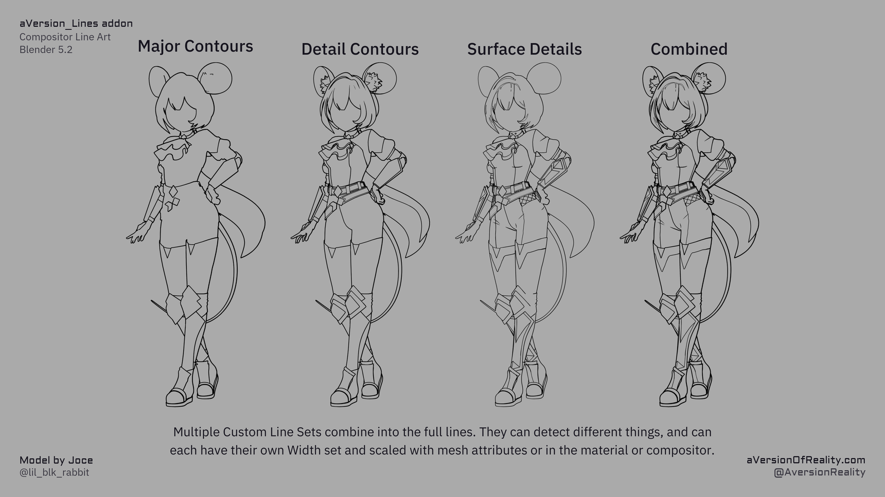
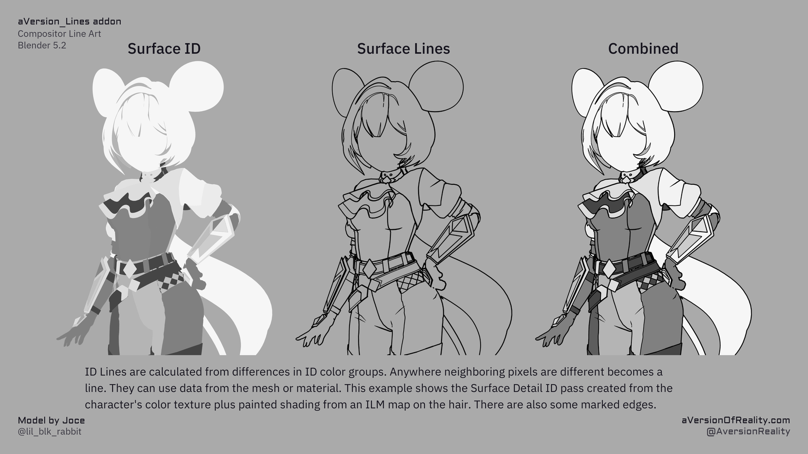
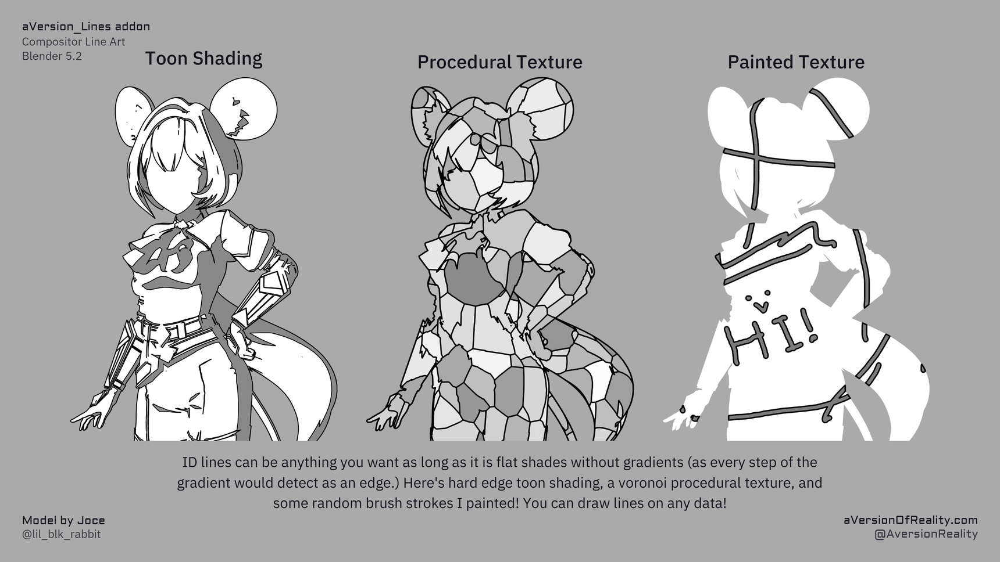

# Infographics

Various infographics collected here.

## Lines and the render

{ width="860" }

[How It Works](how-it-works.md)

## Line detection and expansion

{ width="860" }

[How It Works](how-it-works.md)

## Line sets

{ width="860" }

[Line Types](line-types.md) · [Object & Custom IDs](custom-ids.md)

## ID lines

{ width="860" }

[Object & Custom IDs](custom-ids.md)

## Lines on any data

{ width="860" }

[Object & Custom IDs](custom-ids.md#from-the-shader)

## Width scaling

{ width="860" }

[Width & Scaling](width-and-scaling.md)

## Depth lines

{ width="860" }

[Line Types](line-types.md#depth)

## Normal lines

{ width="860" }

[Line Types](line-types.md#normal)

## Object ID lines

{ width="860" }

[Line Types](line-types.md#object-id) · [Object & Custom IDs](custom-ids.md)
