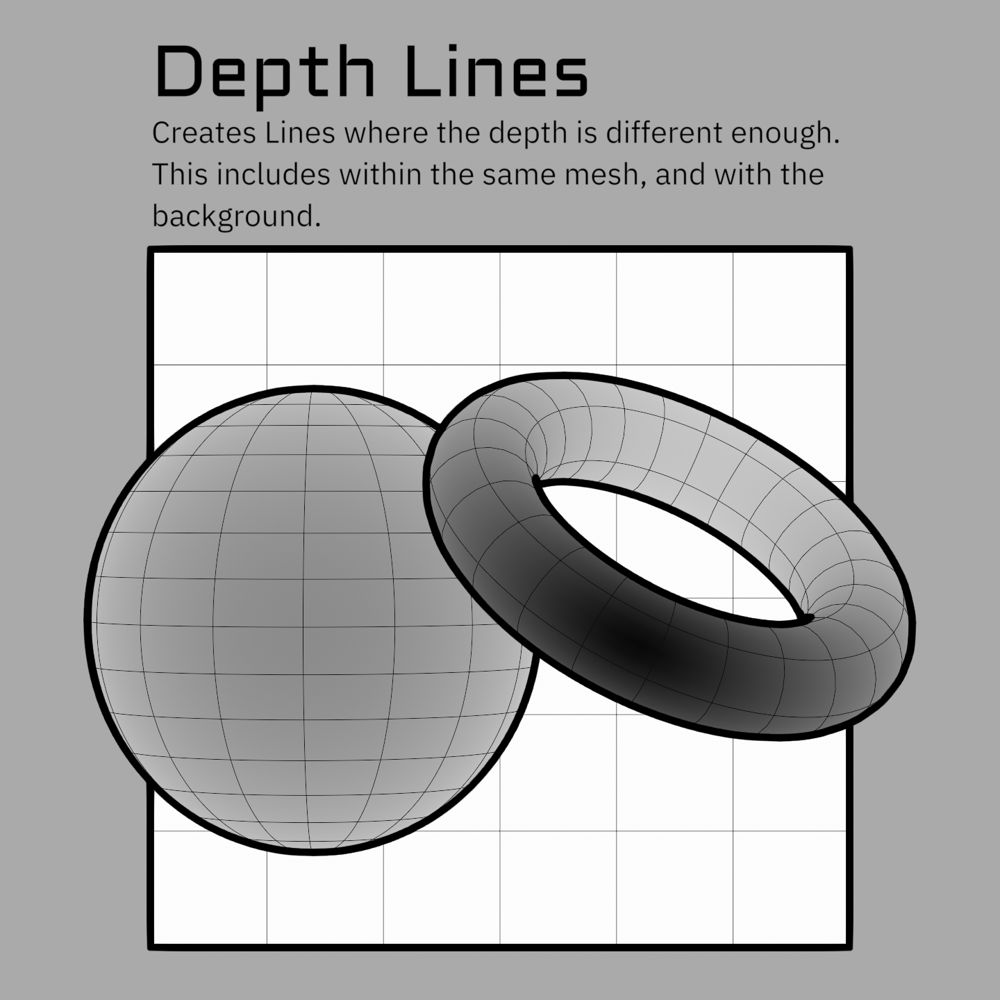
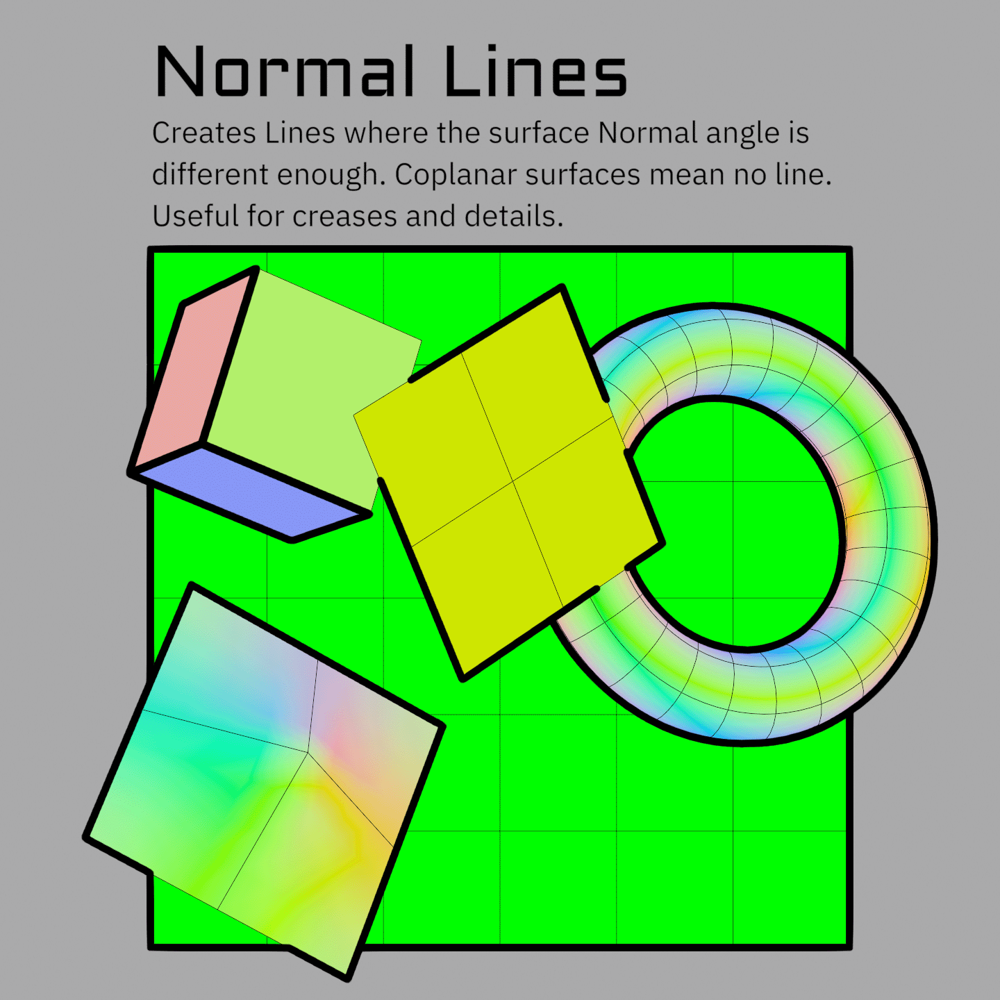
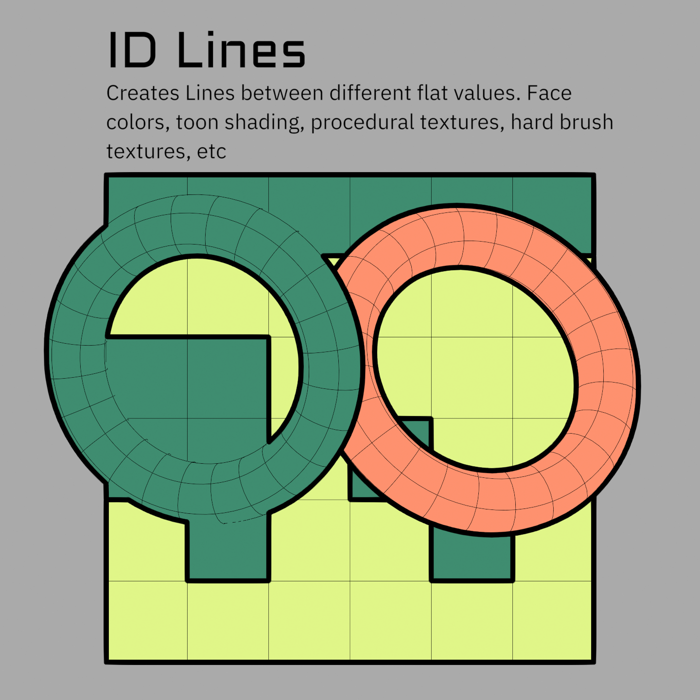

# Line Types

!!! info "Work in progress"
    This page is **minimum viable content** for the initial release. The text covers
    the essentials, but images, diagrams, and clips are still being made, and some
    sections will be expanded. More is being added over the coming weeks.

Lines come from differences between neighboring pixels, so you can draw a line on *any* data that differs between regions. Several line types are set up by default for common data, plus three fully custom passes for anything else.

## The built-in line types

### Depth

Detects where the distance between neighboring pixels changes. The **Depth Threshold** is how big that change must be. This cannot distinguish between depth differences between different areas and steep curvature. Depth Grazing Correction helps with this by using info from the Normals to try to detect slopes, but it often doesn't do enough or does too much.

{ width="860" }

!!! note
    The depth threshold is **not in real-world units**. `0.1` does not mean 0.1 m. Values are usually small, so tune by eye.

### Normal

Detects the **angle difference** between neighboring surface normals, the same idea as auto-smooth edge splitting. The **Normal Threshold** runs 0 to 1 and is logarithmic, so each third of the slider covers a 10x range. Lower values pick up progressively subtler angles, which is why the useful settings are usually low. Tune it by eye rather than trying to work out an angle, the numbers don't correspond to degrees.

{ width="860" }

!!! note
    Depth and Normal lines are much less reliable than ID lines because their data can vary a lot pixel to pixel. This means they will often change quickly from even small camera angle changes, or will detect areas of just a few pixels. These can create flickering, noise, etc. Using them both together eliminates most of this problem as they tend to cover the holes in each other. But they still are often flawed (it also depends heavily on the mesh). There are things I hope to add in the future that will improve both, but for now I suggest using these only in areas that cannot be detected with ID lines (such as the line between a character's chin and neck that doesn't correspond to any particular edge on the mesh). Authoring more detailed thresholds and masks in different areas can also go a long way to making these work well. Do not be discouraged if initial results with them are not great. Also note that you can add these *into* each Custom ID pass, and use them as masks. This is often more robust for capturing things like the chin line. See [Advanced Line Set Options](custom-ids.md#advanced-line-set-options).

### Object ID

Each object gets a random unique ID generated in the Shader_Data group. This causes lines wherever objects overlap each other, or the background (which has ID -1 set in the World nodes). It's similar to a silhouette or contour pass, but not identical because it can create internal lines. These lines depend highly on the object layout of your scene. For example, on a character that is all one object these are functionally identical to Freestyle's External Contour line set or lines created from the Alpha mask. Whereas if each piece is its own object, these will have a lot of internal details.

This makes the use of this line set somewhat arbitrary since it depends so much on your scene setup. But object IDs are also used under the hood in the Jump Flood Algorithm to help with priority sorting. It is fine to add more to object IDs and use this as a 4th Custom ID as more granularity can actually help. See [Object & Custom IDs](custom-ids.md) for how to add more into an ID group.

!!! tip
    The Geo_Data group has a **Treat Islands as Objects** option, giving each connected mesh island its own ID so islands get boundary lines between them. This is often a quick way to get most internal lines you might want.

{ width="860" }

### Custom ID 1–3

Three general-purpose ID passes. Feed them anything: face attributes, vertex colors, painted or procedural textures in the shader, even toon-shading bands. See [Object & Custom IDs](custom-ids.md) for how to author them.

### Marked Edges

Edges you explicitly mark on the mesh, forced to become lines regardless of depth or normals. These are saved attributes generated by the Set Marked Edge Boundaries tool. They work the same as a Custom ID, but with several extra data layers to allow floating edges to work. This is why they can't be combined with or mixed with in either Geo_Data or Shader_Data. They will not work on mesh boundary edges, and may have issues at angles where different objects overlap.

!!! warning
    ID and Marked Edges will detect lines on *both sides* of the boundary edge on coplanar surfaces as there isn't enough of a depth difference to determine which line is in front. This means they technically detect two lines side by side. This is compensated for on line expansion, but means these effectively have minimum line thickness of 2 pixels.

## Thresholds vs. IDs

Depth and Normal lines have a **threshold** because the difference they measure is a matter of degree. You are defining how big of a difference counts as a line.

IDs have no threshold. They either match or they don't, so any difference at all is a line. That is what makes them reliable, and also what makes gradients such a problem in them.

!!! warning "IDs can't use gradients"
    Because any difference counts, ID data **can't be a gradient** without detecting every pixel in it as a line, which means you can't use vertex data (it gets interpolated across the face). Use **Face** or **Face Corner** data so differences only happen between neighboring faces. If you build a Custom ID in the shader instead (e.g. from a texture), use ramps to eliminate gradients.

## Threshold Range

Each threshold has a **Range** next to it that scales line thickness by how far past the threshold a pixel is. Edges that barely qualify come out thinner, which gives you a soft falloff instead of a hard on/off.

It is easy to make a mess with this because an area that looks like a full line may have many sections that barely meet the threshold. Watch out for **Minimum Width** here, as it will thicken the thin values you were trying to fade out. **Width Cutoff** is usually what you want instead. It runs first and discards the thinnest values entirely, so the taper doesn't have to fade out through a band of grey pixels. See [Width & Scaling](width-and-scaling.md).

## Depth Grazing Correction

On a surface curving away from the camera the depth changes fast between neighbors, and every step of it can register as a line. **Depth Grazing Correction** uses the facing angle to hold those back. As noted above it is an approximation, so expect to tune it rather than set it once.

!!! note
    Grazing Correction is currently only an input in the compositor. I have not made it an option in the Geometry Nodes or Shader Nodes because I am hoping to replace it with a better system in the future. For now if you want varying control per material, you'll need to add your own AOV and plug it into the input in the compositor.

## Scales multiply

Every width scale multiplies together, wherever it came from: Geometry Nodes, the shader, and the compositor.

!!! example "Worked example"
    Compositor **Width** = `5`. In an object's modifier, **Depth Scale** = `2` → that object's depth lines are width `10`. Add **Depth Scale** = `0.5` in that object's material → `2 × 0.5 × 5 = 5` again.

This is what lets you set a global width, then adjust per-object and per-material on top. More in [Width & Scaling](width-and-scaling.md).

## Driving scales with data

Any **Scale** input on the Geo_Data modifier can take an attribute instead of a plain value (Face or Face Corner). So you can paint thickness masks as attributes, generate them in an earlier modifier, or build them procedurally. In the shader you can go right down to per pixel, which means you can paint scale as a texture.

---

**Next:** [Width & Scaling](width-and-scaling.md) · [Object & Custom IDs](custom-ids.md)