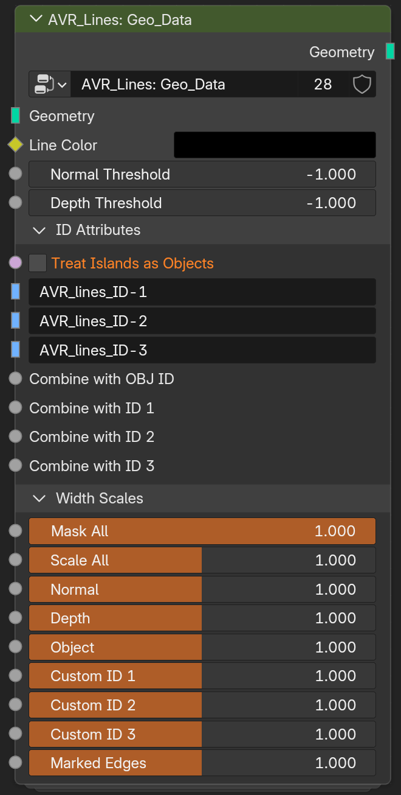

# Geo_Data

`AVR_Lines: Geo_Data` is the **Geometry Nodes** group added as a modifier to your objects (or added within a new modifier). It sets up per-object line data (object IDs, custom ID attributes, marked edges) and per-object width scales that feed the shader and compositor.

!!! tip
    Place this modifier **after** any mesh-altering modifiers so it reads the final geometry.

{ width="660" }

## Geo_Data Node Group Parameters

- **Line Color:** Line color, used in Varying Color mode.
- **Normal Threshold:** Overrides the Normal Threshold set in the compositor group for this object if above 0. At 0 or below, the compositor's threshold is used.
- **Depth Threshold:** Overrides the Depth Threshold set in the compositor group for this object if above 0. At 0 or below, the compositor's threshold is used.

### ID Attributes

- **Treat Islands as Objects:** Give each connected mesh island its own object ID, so islands behave as separate objects.
- **Custom ID 1–3:** Name of the face attribute used as each Custom ID's boundaries. Defaults to the same name the setup scripts use, but can be pointed at any attribute name. Use Face attributes for proper results.
- **Combine with OBJ ID / ID 1–3:** Hashes this input with the ID if greater than 0. Use for combining multiple ID attributes. See [combining IDs](custom-ids.md#combining-ids).

### Width Scales

Per-object multipliers. These multiply with the Shader and Compositor scales. The default slider range is 0-2, but you can enter values above 2, or use an Attribute.

- **Mask All:** Multiplies all line types. Technically the same as 'Scale All', but having two inputs is useful for separating scaling from masking.
- **Scale All:** Multiplies all line types. Technically the same as 'Mask All', but having two inputs is useful for separating scaling from masking.
- **Normal:** Width multiplier for Normal lines.
- **Depth:** Width multiplier for Depth lines.
- **Object:** Width multiplier for Object ID lines.
- **Custom ID 1–3:** Width multiplier for each Custom ID line set.
- **Marked Edges:** Width multiplier for marked-edge lines.

!!! tip "Attribute-driven widths"
    Any Width Scale here can take a **Face or Face Corner attribute** instead of a value, so you can paint detailed thickness masks, or generate them in an earlier modifier. If a vertex group is used (Point domain), it will be interpolated to Face Corner domain.

---

**Related:** [Shader_Data](node-shader-data.md) · [Object & Custom IDs](custom-ids.md) · [Marked Edges](marked-edges.md) · [Width & Scaling](width-and-scaling.md)