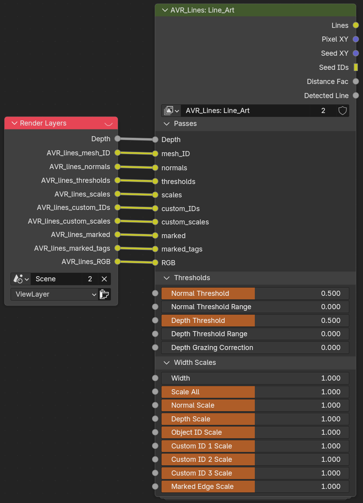

# Line_Art (Compositor Group)

`AVR_Lines: Line_Art` is the **compositor** group at the end of the pipeline. It takes the rendered AOV passes plus the Depth pass, detects and expands the lines, and outputs the final line image. Most of its inputs mirror the addon panel's Thresholds and Width Scales, and editing them in either place writes to the same sockets.

{ width="926" }

## Outputs

- **Lines:** Final composited line art output. This is the one you use.
- **Pixel XY:** Per-pixel screen coordinate pass (debug/advanced use).
- **Seed XY:** Jump-flood seed coordinate pass (debug/advanced use).
- **Seed IDs:** Jump-flood seed ID pass (debug/advanced use).
- **Distance Fac:** Normalized distance factor used for distance-based effects.
- **Detected Line:** Raw detected-line mask before expansion (debug/advanced use).

## Passes *(inputs)*

The rendered data the group reads. The setup wires these from your Render Layers.

- **Depth:** Z-depth pass input.
- **mesh_ID:** Object/mesh ID AOV input. This is the Object ID the expansion uses as the mesh ID when it depth-sorts colored lines. See [The OBJ ID channel does a second job](custom-ids.md#the-obj-id-channel-does-a-second-job).
- **normals:** World-space normal AOV input.
- **thresholds:** Per-pixel threshold AOV input (from Shader_Data).
- **scales:** Per-pixel width-scale AOV input (from Shader_Data).
- **custom_IDs:** Custom face-region ID AOV input.
- **custom_scales:** Per-pixel custom-ID scale AOV input.
- **marked:** Marked edge AOV input.
- **RGB:** Line Color AOV input (Varying Color mode). Depth sorting of this color uses the mesh_ID input above.

## Thresholds

See [Line Types](line-types.md) for what these mean in practice.

- **Normal Threshold:** Detects Normal lines when below the angle between neighbors. 1 = 90deg, 2 = 180deg. Compensated for resolution when Threshold Scaling Mode is Adaptive.
- **Normal Threshold Range:** Scales thickness of Normal lines based on how much they are over the threshold. Lines that barely meet it are thinner, creating soft falloff. Often messy, use with caution. Minimum Line Width can stop clean tapering.
- **Depth Threshold:** Detects Depth lines when the difference between neighbors is higher than the threshold. Not in real-world units (a 0.1 threshold does not mean 0.1m). Compensated for resolution when Threshold Scaling Mode is Adaptive.
- **Depth Threshold Range:** Scales thickness of Depth lines based on how much they are over the threshold. Lines that barely meet it are thinner, creating soft falloff. Often messy, use with caution. Minimum Line Width can stop clean tapering.
- **Depth Grazing Correction:** Masks depth lines based on facing angle to prevent every step being detected on surfaces curving away from the camera.

!!! note "Threshold resolution compensation"
    Detection compares neighbouring pixels, and a pixel covers a different amount of world space at every resolution, so an uncompensated threshold detects more lines at low resolution and fewer at high. It also would not match between the viewport and a render, because the viewport compositor works at the size of the camera frame on your screen rather than the render resolution.

    With **Threshold Scaling Mode** set to Adaptive (the default), the Depth and Normal thresholds are offset against the **Reference Resolution** so one value behaves the same everywhere. This applies to these sockets, and to the per-line-set thresholds inside the group. Working node-only, the compensation lives inside `.AVR_Lines: Detect_Lines`; the `Threshold Adaptive` boolean input switches it, and the `ref_resolution_x` / `ref_resolution_y` / `fit_code` value nodes supply the reference (the addon writes these).

    **Depth Grazing Correction sits outside this.** It attenuates the detection signal rather than the threshold, so surfaces near the grazing angle can still detect somewhat differently between resolutions even in Adaptive mode.

## Width Scales

See [Width & Scaling](width-and-scaling.md).

- **Width:** Base line width in pixels. Each Line Set's scale is multiplied by this.
- **Scale All:** Multiplies all line types. Technically does the same thing as 'Mask All', but it is useful to have two inputs to separating scaling and masking.
- **Normal Scale:** Width multiplier for Normal lines.
- **Depth Scale:** Width multiplier for Depth lines.
- **Object ID Scale:** Width multiplier for Object ID lines.
- **Custom ID 1–3 Scale:** Width multiplier for each Custom ID line set.
- **Marked Edge Scale:** Width multiplier for Marked Edge lines.

!!! note
    These same values are exposed in the addon panel, and editing them there writes to this group. Full socket tooltips are on every input in Blender.

---

**Related:** [How It Works](how-it-works.md) · [Shader_Data](node-shader-data.md) · [Geo_Data](node-geo-data.md)