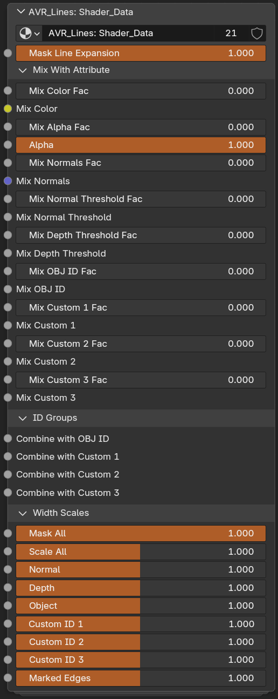

# Shader_Data

`AVR_Lines: Shader_Data` is the **shader** group added to your materials. It writes all the per-pixel data into AOVs (normals, thresholds, scales, IDs, colors) and lets you mix in per-material data before it's written. There are no outputs on this group because the outputs are the AOVs inside the group. Make sure you don't have two of the group in the same material. It can often be convenient to nest it inside your own nodegroup that is put into all your materials so that you can have global settings.

You may not need everything in the group present in any given material. You can copy or ungroup Shader_Data and remove parts that material isn't using if needed. Since the group includes many attributes and eevee has a cap of 15, this will become necessary if your material already uses many. For example, if a material is not using any marked edges or ID passes, you could remove those frames from a copy of the group and save several attributes.

{ width="516" }

## Shader_Data Node Group Parameters

- **Mask Line Expansion:** Masks expanded lines. Use to keep lines from covering an area. This can also be done by mixing the output of the Compositor group in some way, but this is wired up for convenience as you'll often want to mask with material data. For example, if you have a high detail area like a character's eyes that you never want to be covered up. Or if you have other sources of line art, such as textures, and don't want new lines covering it.

### Mix With Attribute

Per-material overrides of the data coming from Geometry Nodes. Each pair is a **Fac** (how much of the new value to blend in) and the value itself. Its a mix node with the value from Geometry Nodes already in the first input.

- **Mix Color Fac:** Mix Fac between Color from Geometry Nodes and new Color.
- **Mix Color:** Color to mix with the Color from Geometry Nodes.
- **Mix Alpha Fac:** Mix Fac between Alpha from Geometry Nodes and new Alpha.
- **Alpha:** Alpha to mix with the Alpha from Geometry Nodes.
- **Mix Normals Fac:** Mix Fac between current Normals and new Normals.
- **Mix Normals:** Custom normal vector to mix with current Normals.
- **Mix Normal Threshold Fac:** Mix Fac between Threshold from Geometry Nodes and new Threshold.
- **Mix Normal Threshold:** Threshold value to mix with the threshold value from Geometry Nodes.
- **Mix Depth Threshold Fac:** Mix Fac between Threshold from Geometry Nodes and new Threshold.
- **Mix Depth Threshold:** Threshold value to mix with the threshold value from Geometry Nodes.
- **Mix OBJ ID Fac:** Mix Fac between OBJ ID from Geometry Nodes and new OBJ ID.
- **Mix OBJ ID:** OBJ ID to mix with the OBJ ID from Geometry Nodes.
- **Mix Custom 1–3 Fac:** Mix Fac between that Custom ID from Geometry Nodes and the new Custom ID.
- **Mix Custom 1–3:** Custom ID value to mix with that Custom ID from Geometry Nodes.

!!! note "Order of operations"
    The ID mixes happen **before** the matching **Combine with** inputs in the [ID Groups](#id-groups) panel. So `Mix OBJ ID` replaces or blends the value coming from Geometry Nodes, and *then* `Combine with OBJ ID` hashes another source into that result.

### ID Groups

Hash another ID source into this material's line set. See [combining IDs](custom-ids.md#combining-ids).

- **Combine with OBJ ID / Custom 1–3:** Hashes this input with the ID if greater than 0. Use for combining multiple ID attributes. Runs *after* the matching **Mix** input in [Mix With Attribute](#mix-with-attribute).

### Width Scales

Per-material width multipliers, the same set as the other groups. These multiply with the Geo_Data and Compositor scales. The default slider range is 0-2, but you can enter values above 2.

- **Mask All:** Multiplies all line types. Technically the same as 'Scale All', but having two inputs is useful for separating scaling from masking.
- **Scale All:** Multiplies all line types. Technically the same as 'Mask All', but having two inputs is useful for separating scaling from masking.
- **Normal:** Width multiplier for Normal lines.
- **Depth:** Width multiplier for Depth lines.
- **Object:** Width multiplier for Object ID lines.
- **Custom ID 1–3:** Width multiplier for each Custom ID line set.
- **Marked Edges:** Width multiplier for marked-edge lines.

!!! note
    Every socket has a tooltip in Blender describing exactly what it mixes or scales.

---

**Related:** [Geo_Data](node-geo-data.md) · [Line_Art](node-line-art.md) · [Object & Custom IDs](custom-ids.md) · [Marked Edges](marked-edges.md)