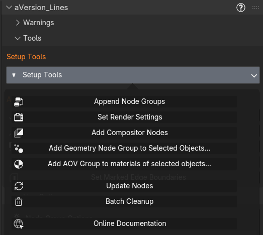

# Setup Tools

The **Setup Tools** popover contains the operators that add node groups to the file and then to your objects and materials, and set the proper settings. And handy options to update to new versions or remove everything from the file. Getting started is simply a matter of running the first 5 in order. See[Quick Start](quick-start.md)

{ width="523" }

## Append Node Groups

Brings the **Geo_Data**, **Shader_Data**, and **Line_Art** node groups into your file from the bundled asset. Groups already present are skipped. (The Distance_Scale groups come in with these as dependencies.)

## Set Render Settings

Opens a dialog of render-side toggles, all on by default:

- **Enable Depth Pass:** the Z pass, required for depth lines, priority sorting, and distance scaling.
- **Filter Size = 0:** disables film anti-aliasing. Required for clean detection; AA is re-added by the compositor node. See [How It Works](how-it-works.md).
- **Compositor device = GPU:** CPU works but is very slow.
- **Rendered Viewport Compositor:** show the compositor result in Rendered viewports (Always / Camera Only / Don't Change). The Material Preview equivalent lives in the panel, under [Line Options → Detection, Scale, and Expansion Options → Viewport Camera](addon-panel.md), alongside the Rendered setting.
- **Viewport precision = Full:** avoids Z-fighting for colored lines in the viewport.
- **Add Shader Group to World:** optional, for background handling.
- **AOV toggles:** create the AVR_lines AOVs (leave on for a normal setup).

## Add Compositor Nodes

Splices an **Alpha Over**, an **Anti-Aliasing** node, and the **Line_Art** group into your compositor just before the output, wiring the Render Layers passes into the Line Art inputs.

!!! note "The AA node and the image border"
    The Anti-Aliasing node can blur the outermost pixels of the image, because its samples run off the edge of frame and clamp back onto the border pixel. Render a little larger and crop if that matters. See [Known Issues](known-issues.md).

## Add Geometry Node Group to Selected Objects

Adds the **Geo_Data** group to your selected mesh/curve objects. A **Mode** dialog controls how:

- **Add directly as a modifier:** assigns Geo_Data directly as a modifier.
- **Add within the node graph of a new modifier shared by selected objects** *(default)*: one shared wrapper tree assigned to every selected object with Geo_Data placed inside. This is best if you want your configuration to effect many objects. Individual ones can still have unique copies of this group made.
- **Add within the node graph of a new modifier per selected object:** a fresh wrapper per object.

!!! tip
    Keep the modifier **after** any mesh-altering modifiers so it reads the final geometry.

## Add AOV Group to Materials of Selected Objects

Adds the **Shader_Data** group to the materials on your selected objects, so they write the per-pixel AOVs. Can be added to each material, or into a new node group that is added to each material (default.) The second allows settings to be shared by all materials conveniently, and the group can always be ungrouped to do separate per-material settings.

## Update Nodes

Replaces the bundled groups with fresh copies from the asset file while **preserving your current parameter values**. Use it after updating the add-on. Options let you choose Compositor / Shader / Geo, and whether to also update **renamed or duplicated** copies of the groups.

## Batch Cleanup

Opens a dialog to remove what the add-on added (modifiers, shader groups, compositor setup, node-group datablocks, AOVs) and to reset render settings to defaults. Tick what you want removed.

!!! tip
    Open the system console before running any of these. Each prints exactly what it changed.

---

**Related:** [Authoring Tools](authoring-tools.md) · [Manual / Node-Only Setup](installation.md#manual-node-only-setup)