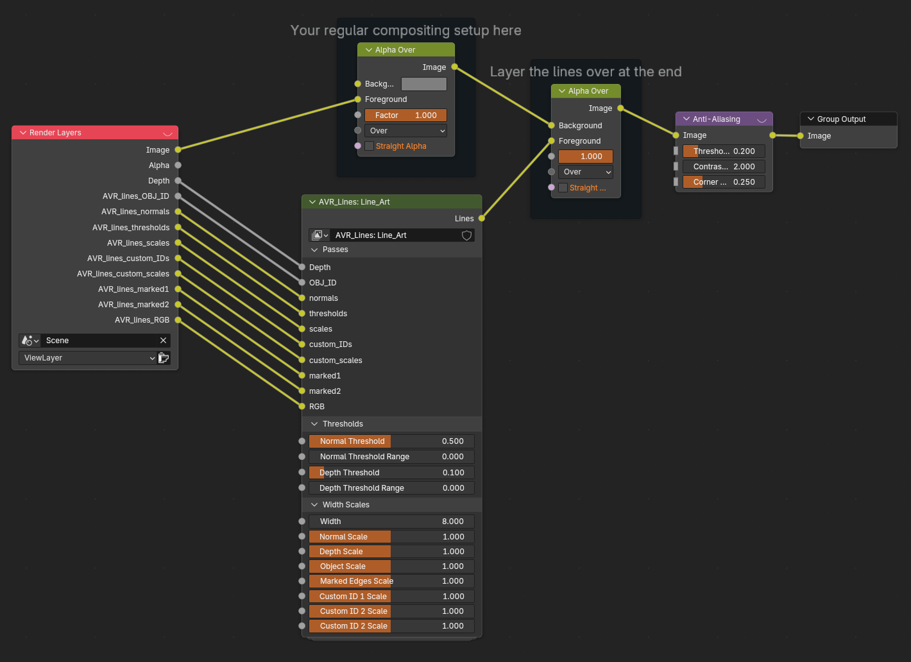
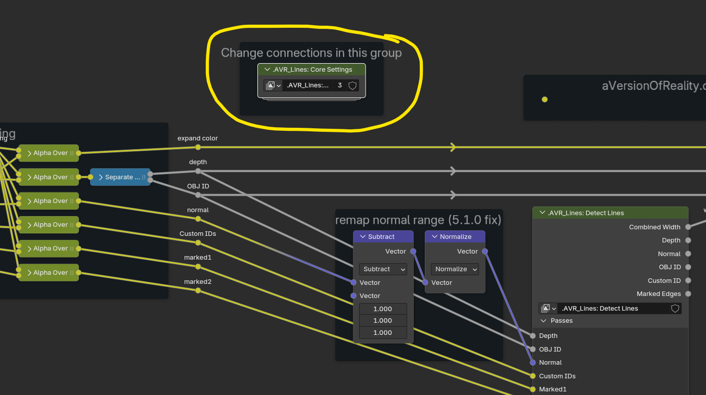
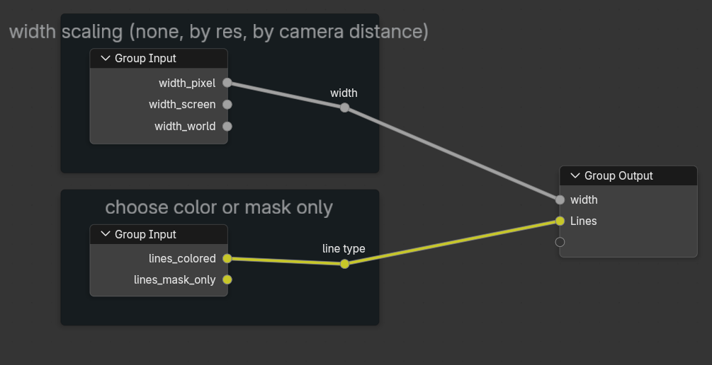
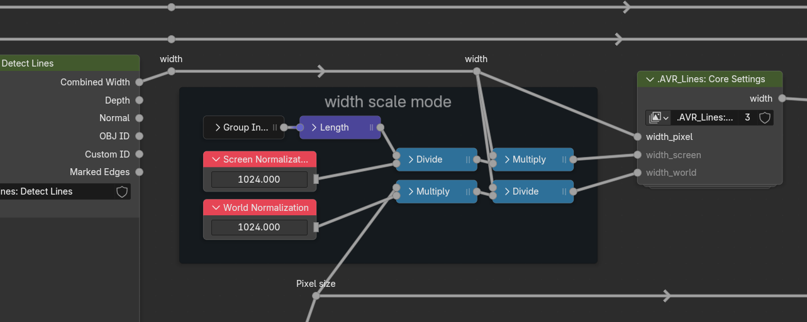

# Setup

## Setup Using the addon:

*(addon is still wip)*

___
## Manual setup:

*The upcoming addon will automate all of this!*

**Append the main node groups:**

- AVR_Lines: Line_Art
- AVR_Lines: Shader_Data
- AVR_Lines: Geo_Data

**(Optional) Append the setup scripts:**

- AVR_lines_setup_AOVs.py
- AVR_lines_setup_Modifiers.py
- AVR_lines_setup_Shader.py

**Create AOVs with these exact names and types, or run AVR_lines_setup_AOVs.py**

- AVR_lines_OBJ_ID, VALUE
- AVR_lines_normals, COLOR
- AVR_lines_thresholds, COLOR
- AVR_lines_scales, COLOR
- AVR_lines_custom_IDs, COLOR
- AVR_lines_custom_scales, COLOR
- AVR_lines_marked1, COLOR
- AVR_lines_marked2, COLOR
- AVR_lines_RGB, COLOR

**Render Settings:**

- Ensure the Depth pass in enabled in View Layer -> Passes -> Data
- Disable Anti-Aliasing by setting Filter Size to 0 in Render -> Film
- If you want them in the viewport, ensure Compositor is set to Always in the viewport render settings.
- If using Colored lines, Enable Full Precision in the Compositor N Panel -> Options Tab or there will be Z fighting in the viewport
- Ensure the Compositor Device is set to GPU in the same tab (CPU should work but you'll be waiting a long time.)

**Data Groups:**

For any objects you want lines on, add the Geo_Data geometry nodes group as a modifier (after any mesh altering ones), and add the Shader_Data node group to their material. Or use the Modifiers and Shader setup scripts to automatically add these to all selected objects or their materials.

*v0.1 Note: Technically, the setup does not require these Data groups to run and only needs them to provide data beyond the defaults. But I have not fully tested this for v0.1, so for now just use them all. In the future there will be better options to not use them unless needed.**

**Compositor:**

- Add the Line_Art group to your compositor setup and connect the AOVs and Depth Pass.
- Combine the Lines with your render by using an Alpha Over node (or color mix of your choice, depending on what you do with them.)
- As Anti-Aliasing is disabled, the node must be used instead. The Lines have their own AA node inside the group, so you need a second for the main render. It doesn't hurt for it to run on the lines again, so put it last.

#### Settings inside the node group:

There are several options that cannot be made inputs on the node group without major performance issues due to how the Compositor compiles. These can only be changed by going into the group and changing the connections. (The full addon will handle this automatically).

**Max Width:**

Choose the Max Width in pixels at the end of the node tree. Usually 4-8 is sufficient even for thick lines. But if you have more scaling on some lines than others, or are using World scaling (distance from camera) you may need more in closeups.

The line detection works by checking all pixels around the current pixel in expanding rings. The performance cost is based on the number of rings checked, which is controlled by the Max Width. Each extra ring costs more and more compute and vram! So if you have a Max Width of 10, but your lines are only set to width 5, then you are still paying the cost to check out to 10! Widths above 10 start getting heavy very quickly, and will consume enormous amounts of vram at high resolutions.

**Connections Group:**

Other connections can be found inside this group, so you can change them from one place without digging through nested node groups.

Width Scaling Mode:
- Pixel = line width is a flat value in pixels
- Screen = the width is adjusted based on the screen resolution, so width stays consistent even if you change resolution
- World = the width is scaled by the world pixel size, which is calculated from depth and camera lens horizontal FOV. This means lines stay the same thickness in world space regardless of camera distance or lens size (aka, Distance from Camera scaling). In the viewport, this only works when viewing through the Active Camera

The scaling values for width are found in the main group:

**Color Mode:**

- Colored = Supports different colors and widths per line. Uses depth priority sorting so lines of a closer point take priority. But there can be z-fighting for lines at the same depth or close (due to float precision issues), most notably if meshes with different colors intersect. *This can hopefully be improved in a future version.*
- Mask Only = The lines are only an alpha mask, but can have different thickness. Much more performant due to not needing priority sampling! Always switch to this if your lines are only a single color.
- *(Upcoming) - Mask only, mono thickness = Vastly better performance but all lines are also the same thickness (standard compositor filters).*
