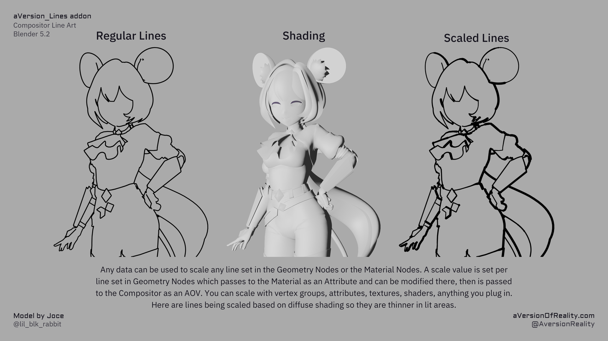
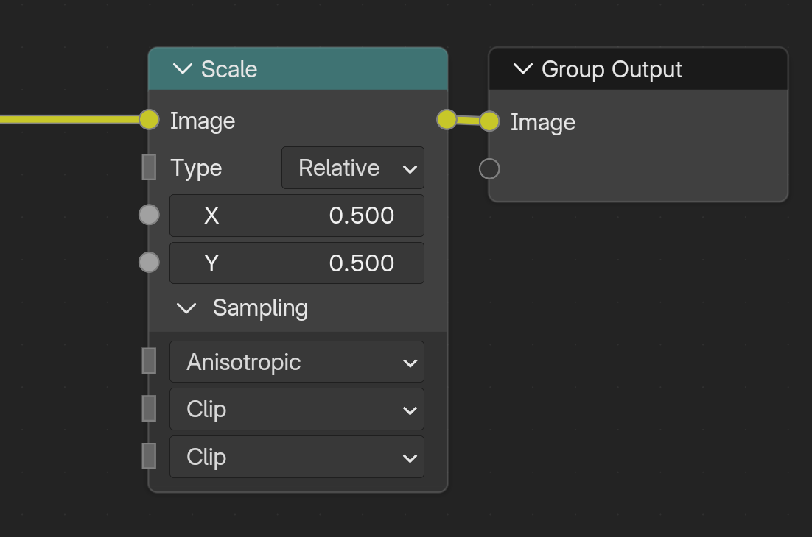

# Width & Scaling

How thick your lines get and how to vary that per line type in the Geometry Nodes, Material, or Compositor.

## Base Width and per-type scales

There's one **base Width** (in the Line_Art group / addon panel), and a **Width Scale** for each line type (Normal, Depth, Object, Custom ID 1-3, Marked Edges).

All the scales **multiply**: the base Width, the per-object scales in the Geo_Data modifier, and the per-material scales in Shader_Data. So you get a global dial plus fine adjustment per object and per material. See [Line Types](line-types.md).

There's also **Mask All** and **Scale All**, which both multiply every line type. They do exactly the same math. Having two of them is just so you can keep masking and scaling on separate inputs instead of multiplying them together yourself, which gets tedious.

## Width Scaling Mode

**Pixel** means width values are literal pixels. Width `5` gives 5 pixel lines, whatever the render resolution or camera lens.

**Adaptive** compensates for render resolution and camera focal length against your **Reference** settings, so a shot keeps the same look when you change resolution or lens. At the reference resolution and focal length the values are literal pixels again.

!!! note "Reference settings"
    Adaptive mode compares the current render to **Reference Resolution X/Y** and **Reference Focal Length**. If you authored settings in Pixel mode and want to keep them, set these to the resolution and lens you authored your widths at.

Beyond the plain values, any data you can get into the pipeline can drive a scale. Here lines are scaled by diffuse shading, so they thin out in the lit areas:

{ width="860" }

The scale is set per line set in Geometry Nodes, passes to the material as an Attribute where you can modify it, then goes to the compositor as an AOV. Vertex groups, attributes, textures, shaders, anything you plug in. See [Line Types](line-types.md#driving-scales-with-data).

Distance-from-camera scaling is a separate feature, see [Distance Scaling](distance-scaling.md).

## Width Cutoff and Minimum Width

Both of these deal with lines that end up thinner than a pixel. **Width Cutoff runs first**, then Minimum Width.

**Width Cutoff** masks out any line below the thickness you set, before Minimum Width gets a chance to thicken it. A line thinner than a pixel can't fill less than a pixel, but also should have less strength. So it just makes it a lighter grey. So a line scaling down toward 0 (by distance, or by a threshold Range) has to pass through a band of grey mush on its way out. Cutting those values throws the line away instead of letting it fade through that. The downside is that lines you actually want to taper to 0 lose some sharpness at the tip. Neither of these effects matters visually at higher resolutions, and the fade-through-grey is normal for lines that taper smoothly to 0. The problem is lines that are so thin they are mostly less than 1, and thus grey.

**Minimum Width** then sets a floor on whatever survived. Note that below 2 you can get aliasing issues. The best is minimum width of 1.5-2, and render at high enough resolution for this to still be thin. Rendering at double resolution and then downscaling also resolves most anti-aliasing issues.

So if tapering lines look muddy as they fade, raise Width Cutoff. If thin lines look patchy or aliased, raise Minimum Width.

!!! note "Neither one is resolution adaptive"
    These are pixel values and they stay pixel values. Minimum Width of 5 means something very different in a 1024x1024 viewport than in a 4096x4096 render. Use them as a guard against tiny values, not to set the look. Do that with the actual width scale.

## Max Width

Detection finds single pixel edges, and the **Jump Flood** expansion is what makes them thick. **Max Width** sets how far that expansion can reach. **Every pixel pays for the full range whether its lines are that thick or not, so don't use more than you need!**

So with Max Width at `18` and your thickest line at `5`, you are paying to evaluate out to 18 across the whole image for nothing. The cost climbs quickly and eats VRAM at high resolutions. Use the smallest preset that covers your thickest line.

The high presets (`~38`, `~78`) are there for genuinely thick lines, or distance scaling that pushes width up in close-ups, or supersampled renders you intend to scale down. On a normal shot `~8` to `~18` is plenty.

### Downscaling a supersampled render

If you are rendering large to scale down, do it with a **Scale** node at the very end of the compositor, after the lines have been composited. Set **Type** to *Relative* and both **X** and **Y** to the fraction you want, so `0.5` halves the resolution. Set **Sampling** to *Anisotropic*, which gives the cleanest result on lines.

{ width="551" }

Scaling down after detection is why supersampling helps in the first place. Detection runs at the large resolution, so it resolves detail a smaller render would miss, and the downscale then anti-aliases the result properly. Blender's downsampling with the scale node is not very advanced, so only use it to scale by exactly 0.5. If you wanted 25%, chain two 0.5 nodes. Or save out at full resolution and do the downsampling in another image program that can handle it better.

!!! note
    If you are working with very thick lines at super resolutions (such as rendering at 8k so you can downsample to 4k), then 78px thick may not be enough. That limit is only there because each Jump Flood Pass is another copy of the nodes. Adding another pass would be a nightmare by hand, but I've got it on my todo list to add the option to add more as the complex groups are built with python anyway. If you manage to hit the limit before I get around to this, shoot me a message and I'll prioritize it.

See [Technical Notes](technical-notes.md) for the full performance picture.

---

**Next:** [Distance Scaling](distance-scaling.md) · [Object & Custom IDs](custom-ids.md)